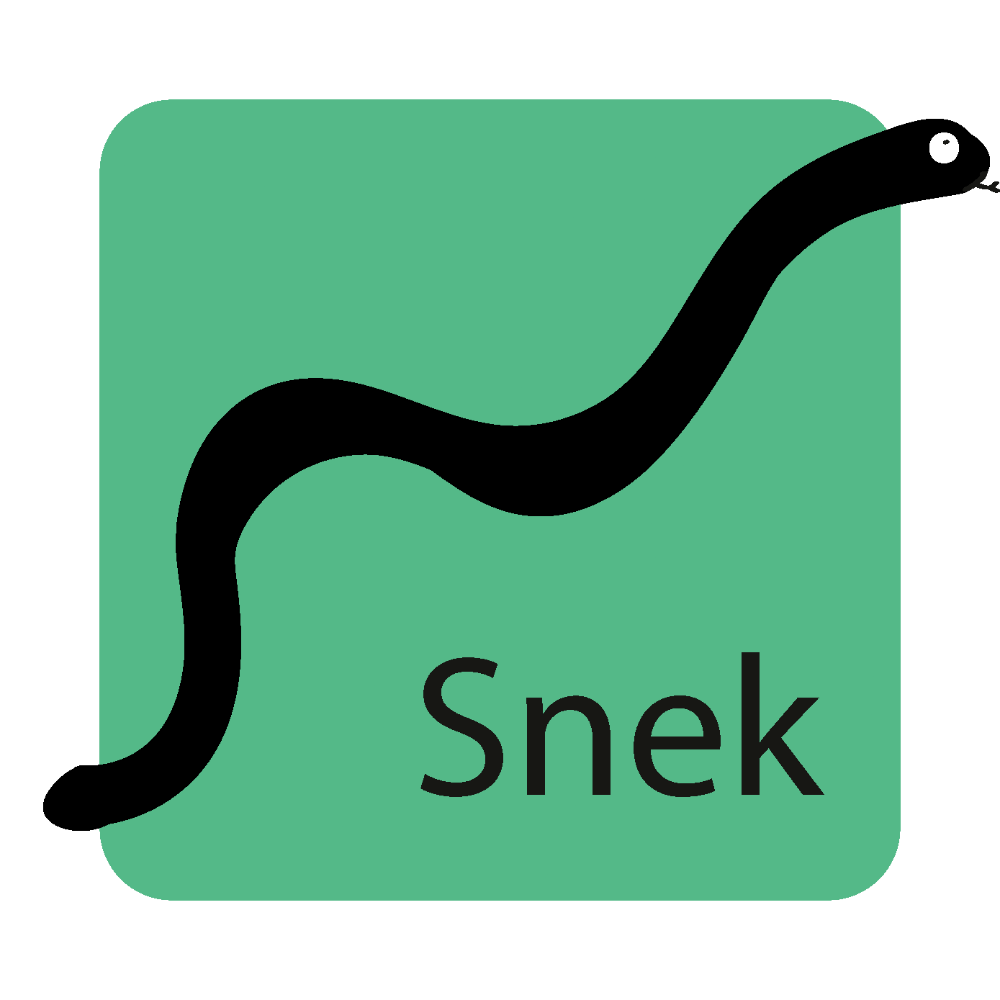
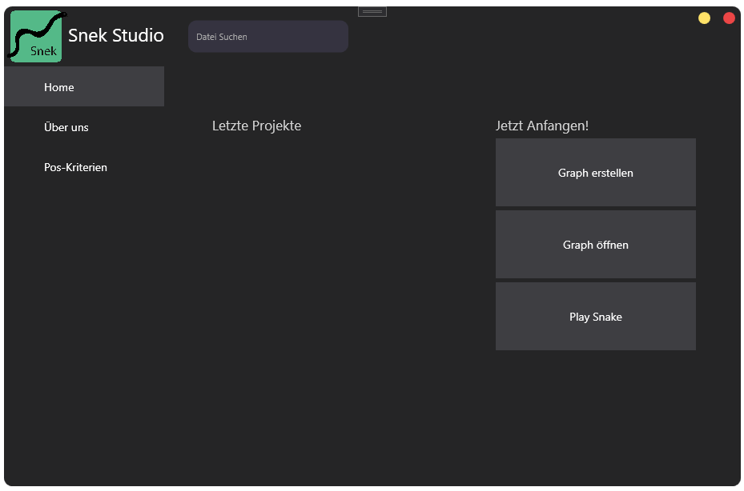
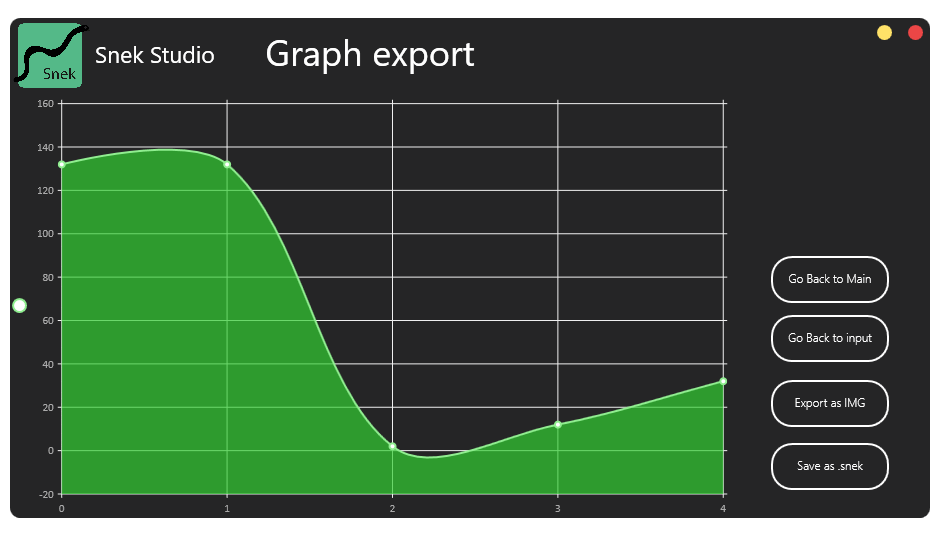
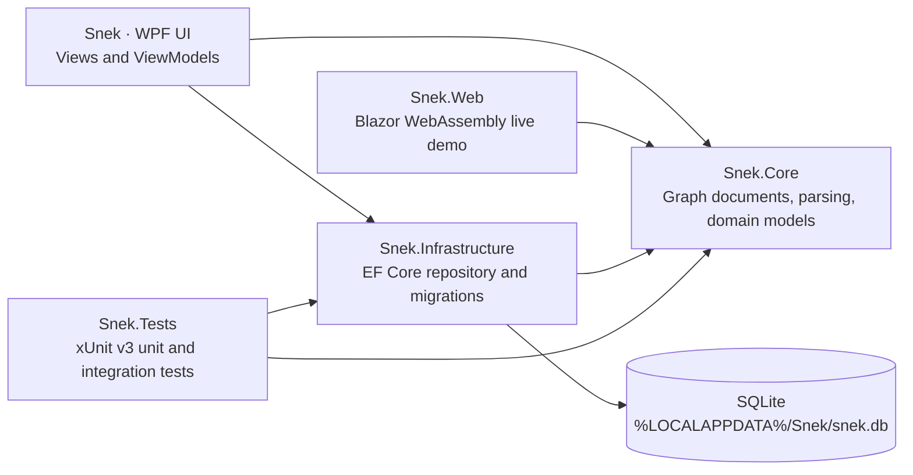

<div align="center">
  
  <h1>Snek Studio</h1>
  <p>An old school project brought back to life with a supported, modern .NET stack.</p>

  [](https://github.com/General-Iroh32/Snek/actions/workflows/ci.yml)
  [](https://general-iroh32.github.io/Snek/)
  
  
  [](LICENSE)
</div>

<div align="center">
  <a href="https://general-iroh32.github.io/Snek/"><strong>Live browser demo</strong></a>
  ·
  <a href="https://github.com/General-Iroh32/Snek/releases/latest/download/Snek-Studio-win-x64.zip"><strong>Download for Windows</strong></a>
</div>

Choose the browser demo for a zero-install tour of the shared graph domain, or download the Windows build for the complete WPF workspace, SQLite-backed POS view and desktop export flow.

## Why this project was modernized

Snek started as a school project and originally targeted .NET 5. I returned to it because I cannot stand leaving working software stuck on unsupported runtimes and abandoned dependencies. The goal was not to disguise its origins or replace everything with a different application, but to preserve the original ideas while bringing the engineering up to date.

The chart creator, SQLite-backed POS overview, original seed data and Snake mini-game are still part of the project. Around them, the application was migrated to .NET 10, vulnerable and outdated packages were replaced, domain and persistence logic were separated from WPF, and automated tests, CI, releases and a browser version were added.

## What it does

Snek Studio creates line, column, row, pie and doughnut charts from user-provided values. A chart can be exported as PNG or stored in the small, human-readable `.snek` format and opened again later. The application also contains a POS effort overview backed by SQLite and the original Snake mini-game.

`Snek.Web` is an interactive Blazor WebAssembly companion for anyone who does not have Windows available. It references the same `Snek.Core` project as the WPF application, so graph parsing, validation and `.snek` serialization in the browser are the real shared domain code rather than a mock-up.

- Windows 10 version 2004 or newer
- .NET 10 LTS and modern WPF
- LiveCharts2 with SkiaSharp rendering
- SQLite persistence through EF Core migrations
- MVVM with CommunityToolkit.Mvvm
- Generic Host dependency injection and application lifecycle
- Nullable reference types and warnings-as-errors

## Screenshots

These are real screenshots of the original UI. Updated screenshots of the Visual Studio-inspired workspace will replace them after the Windows VM visual test.





## Architecture


```mermaid
flowchart LR
    UI["Snek · WPF UI\nViews and ViewModels"]
    CORE["Snek.Core\nGraph documents, parsing, domain models"]
    INFRA["Snek.Infrastructure\nEF Core repository and migrations"]
    DB[("SQLite\n%LOCALAPPDATA%/Snek/snek.db")]
    TESTS["Snek.Tests\nxUnit v3 unit and integration tests"]
    WEB["Snek.Web\nBlazor WebAssembly live demo"]

    UI --> CORE
    WEB --> CORE
    UI --> INFRA
    INFRA --> CORE
    INFRA --> DB
    TESTS --> CORE
    TESTS --> INFRA
```

The WPF project is the composition root. It configures the .NET Generic Host, dependency injection and the application-specific SQLite location. `Snek.Core` has no UI or database dependency, so graph parsing, serialization and time calculations are independently testable. `Snek.Infrastructure` owns EF Core, relationship queries, seeding and schema migrations.

The database is migrated on startup and seeded only when it is empty. Existing user data is never deleted during normal startup.

## Build and run on Windows

Requirements:

- Visual Studio 2026 with the .NET desktop development workload, or the .NET 10 SDK
- Windows 10 2004 (build 19041) or newer

```powershell
git clone https://github.com/General-Iroh32/Snek.git
cd Snek
dotnet restore Snek.sln
dotnet build Snek.sln --configuration Release
dotnet run --project Snek/Snek.csproj
```

The application database is created at `%LOCALAPPDATA%\Snek\snek.db`.

For a complete visual, keyboard, graph export, persistence and Snake checklist, follow the [Windows VM test plan](docs/WINDOWS_VM_TESTING.md).

## Test and validate

The test project uses the current xUnit v3 in-process runner and includes real in-memory SQLite migration and repository tests.

```powershell
dotnet run --project Snek.Tests/Snek.Tests.csproj --configuration Release
dotnet list Snek.sln package --vulnerable --include-transitive
dotnet ef migrations has-pending-model-changes `
  --project Snek.Infrastructure/Snek.Infrastructure.csproj `
  --configuration Release
```

To create a new migration after changing the EF model:

```powershell
dotnet ef migrations add MigrationName `
  --project Snek.Infrastructure/Snek.Infrastructure.csproj `
  --output-dir Persistence/Migrations
```

## Cross-build with OrbStack or Docker

WPF runs only on Windows, but compilation, tests, package auditing and migrations can be checked from macOS or Linux with the official .NET SDK image:

```bash
docker run --rm \
  --mount type=bind,source="$(pwd)",target=/src \
  --workdir /src \
  mcr.microsoft.com/dotnet/sdk:10.0 \
  dotnet build Snek.sln --configuration Release

docker run --rm \
  --mount type=bind,source="$(pwd)",target=/src \
  --workdir /src \
  mcr.microsoft.com/dotnet/sdk:10.0 \
  dotnet run --project Snek.Tests/Snek.Tests.csproj --configuration Release
```

This validates the code and Windows-targeting reference assemblies, but it does not render or interact with the WPF UI.

## Windows CI and release artifact

Every pull request and push to `main` runs on a genuine GitHub-hosted Windows runner. The workflow:

1. restores and audits all NuGet packages;
2. builds the complete solution with warnings treated as errors;
3. runs all xUnit tests;
4. checks EF Core migration drift;
5. publishes a framework-dependent `win-x64` application;
6. uploads `Snek-win-x64-<commit>` as a downloadable workflow artifact.

The artifact requires the .NET 10 Desktop Runtime on the destination machine.

Tagged releases additionally publish a self-contained `Snek-Studio-win-x64.zip`, which does not require a preinstalled .NET runtime. The permanent latest-release URL is linked at the top of this README.

## Technology

- .NET 10 LTS / C# / WPF
- CommunityToolkit.Mvvm 8.4
- LiveCharts2 2.0 / SkiaSharp
- EF Core 10 / SQLite
- Microsoft.Extensions.Hosting
- xUnit v3 with Microsoft Testing Platform support
- GitHub Actions on `windows-latest`

## License

Snek is licensed under the [GNU General Public License v3.0](LICENSE).
