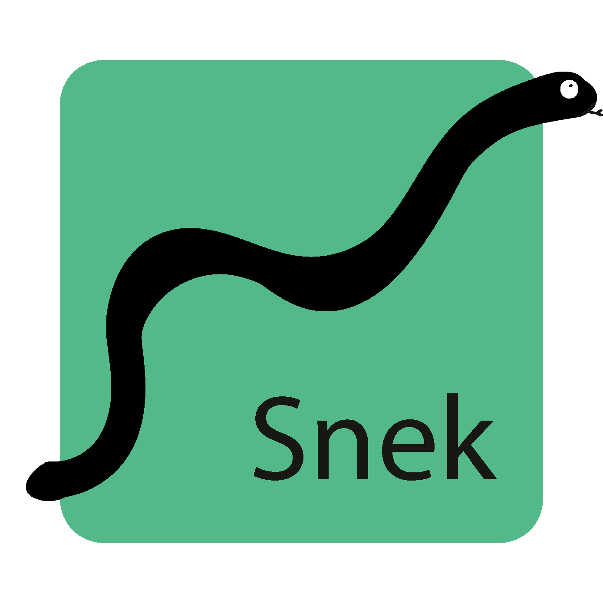

[![Contributors][contributors-shield]][contributors-url]
[![Forks][forks-shield]][forks-url]
[![Stargazers][stars-shield]][stars-url]
[![Issues][issues-shield]][issues-url]


<!-- PROJECT LOGO -->
<br />
<p align="center">
  <a href="https://github.com/General-Iroh32/Snek">
    
  </a>

  <h3 align="center">Snek</h3>

  <p align="center">
    Wpf Graph Creator 
    <br />
    <br />
    <a href="https://github.com/General-Iroh32/Snek/issues">Report Bug</a>
    ·
    <a href="https://github.com/General-Iroh32/Snek/issues">Request Feature</a>
  </p>
</p>


<!-- TABLE OF CONTENTS -->
<details open="open">
  <summary>Table of Contents</summary>
  <ol>
    <li>
      <a href="#about-the-project">About The Project</a>
      <ul>
        <li><a href="#built-with">Built With</a></li>
      </ul>
    </li>
    <li>
      <a href="#Howtostart">How to start</a>
    </li>
    <li><a href="#PreviewGraph">Preview Graph</a></li>
  </ol>
</details>


<!-- ABOUT THE PROJECT -->
## About The Project

![Snek Screen Shot][product-screenshot]

Snek is a Tool to create Graphs and to export them as .PNGS. Its insanely quick.s

You may also suggest changes by forking this repo and creating a pull request or opening an issue.

### Built With

This section should list any major frameworks that you built your project using. Leave any add-ons/plugins for the acknowledgements section. Here are a few examples.
* [C#](https://docs.microsoft.com/en-us/dotnet/csharp/tour-of-csharp/)
* [WPF](https://docs.microsoft.com/en-us/dotnet/desktop/wpf/overview/?view=netdesktop-5.0)
* [LiveCharts](https://lvcharts.net/)


<!-- GETTING STARTED -->
## Howtostart

 ```sh
  git clone https://github.com/General-Iroh32/Snek.git
  ```
  Either open the sln and build it with VS2019 or 
  <br />
  <br />
  head over to \Snek\bin\Debug\net5.0-windows and start the Snek.exe

### PreviewGraph

![Snek Screen Shot][product-screenshot2]


<!-- MARKDOWN LINKS & IMAGES -->
<!-- https://www.markdownguide.org/basic-syntax/#reference-style-links -->
[contributors-shield]: https://img.shields.io/github/contributors/General-Iroh32/Snek.svg?style=for-the-badge
[contributors-url]: https://github.com/General-Iroh32/Snek/graphs/contributors
[forks-shield]: https://img.shields.io/github/forks/General-Iroh32/Snek.svg?style=for-the-badge
[forks-url]: https://github.com/General-Iroh32/Snek/network/members
[stars-shield]: https://img.shields.io/github/stars/General-Iroh32/Snek.svg?style=for-the-badge
[stars-url]: https://github.com/General-Iroh32/Snek/stargazers
[issues-shield]: https://img.shields.io/github/issues/General-Iroh32/Snek.svg?style=for-the-badge
[issues-url]: https://github.com/General-Iroh32/Snek/issues
[product-screenshot]: Snek/Images/Snek_ss.png
[product-screenshot2]: Snek/Images/Snek_usage.png
